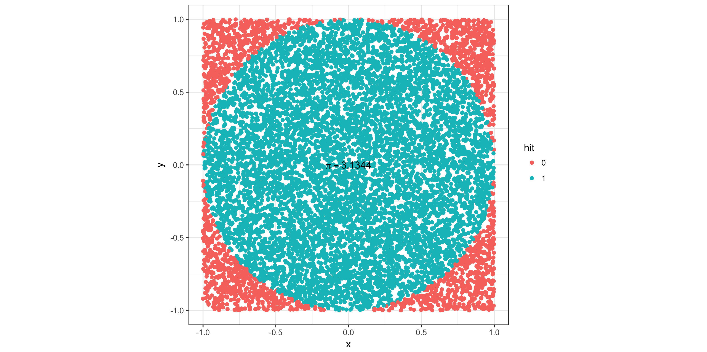

# pi_approximation

An R-script for approximating pi using Monte Carlo simulations.

Given a square with side length 'D', in which a circle is drawn, with diameter 'D', pi can be approximated by the fraction area_circle / area_square = pi x (D/2)^2 / D^2 = pi x D^2 / 4D^2 = pi / 4. Hence if we calculate the above fraction and multiply it with 4, we get pi! Here is an example of throwing 10,000 darts and then doing the before mentioned calculation.

